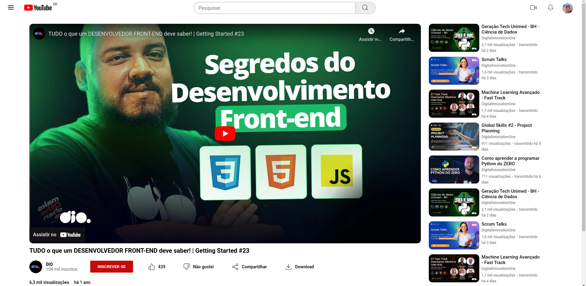

# clone-pagina-assistindo-youtube

Clone de uma página do Youtube que simula a página de reprodução de um vídeo e mostra os vídeos recomendados ao lado para exercitar principalmente os conceitos de flexbox no CSS. Projeto recomendado pela formação "CSS Web Developer" lecionada pela DIO.

## Acesse a página: [https://murilomarsoli.github.io/clone-pagina-assistindo-youtube/](https://murilomarsoli.github.io/clone-pagina-assistindo-youtube/)

